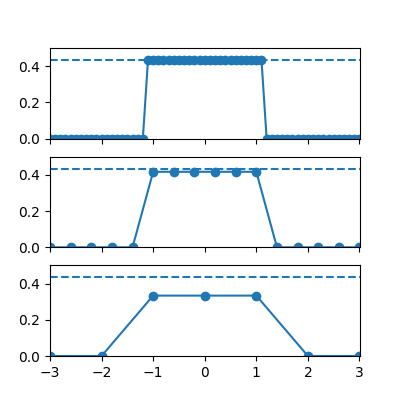
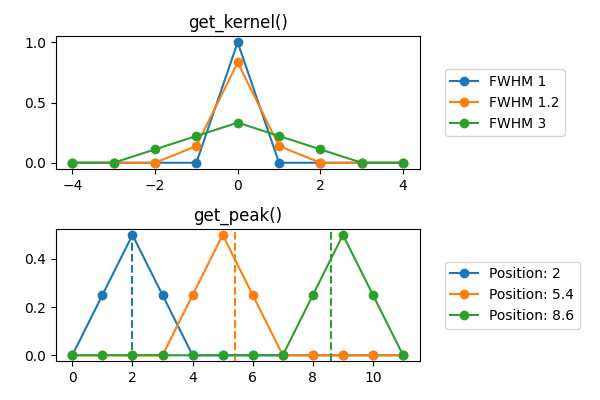

IDEAL
#####

The IDEAL instrument is synthetic and supports a variety of
energy-independent 1-D broadening models. It is mainly intended for
testing and experimentation.

Sampling issues
---------------

It isn't always straightforward to represent an "ideal" broadening kernel on a coarse grid.
Depending on the position and scale, key points of the shape might not align to the grid.

Boxcar
^^^^^^

The boxcar (rectangular) broadening kernel has a theoretical height of ``1 / width`` but this assumes perfectly steep sides. As the sampled kernel is always effectively trapezoid, they are renormalized to produce the correct area for the actual trapezoid.

Triangular and trapezoid
^^^^^^^^^^^^^^^^^^^^^^^^

The triangular and trapezoid functions have the correct shape and area
when aligned to grid points. If the width parameter(s) are not
commensurate with the grid, it is possible to obtain inaccurate shape
and scaling.

To help manage this, the ``get_peak()`` method precomputes a
zero-centered kernel and rounds the peak positions to the nearest
point, giving a consistent shape.

.. include:: ../../include/auto-instruments/ideal-auto.rst
